# Network Simulator - OOP Architecture Design

## Overview

This document outlines the Object-Oriented Programming architecture for the network simulator. All network devices, endpoints, and connections will be represented as classes with clear inheritance hierarchies and polymorphic behavior.

## Visual Diagrams Index

This document includes the following Mermaid diagrams for visual understanding:

1. **Class Hierarchy Diagram** - Complete class inheritance structure with properties and methods
2. **Packet Flow Sequence Diagram** - Step-by-step packet transmission between devices
3. **Packet Flow Process Diagram** - Decision flow for packet processing
4. **Device Status State Diagram** - Device lifecycle and state transitions
5. **Component Architecture Diagram** - High-level system component relationships
6. **Switch Decision Flow** - Switch packet forwarding logic
7. **Router Routing Flow** - Router routing decision process
8. **Firewall Rule Evaluation** - Firewall packet filtering flow
9. **Factory Creation Flow** - Device creation process
10. **Network Topology Example** - Example network topology visualization
11. **ARP Resolution Sequence** - ARP request/response flow
12. **Directory Structure Diagram** - File organization visualization

All diagrams use Mermaid syntax and will render properly in Markdown viewers that support Mermaid (GitHub, GitLab, VS Code with extensions, etc.).

---

## Class Hierarchy

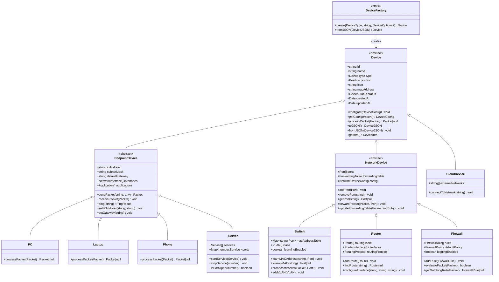

---

## Core Classes

### 1. Device (Abstract Base Class)

**Purpose**: Base class that all network devices inherit from. Provides common properties and methods.

**Properties**:
- `id: string` - Unique identifier (UUID)
- `name: string` - Human-readable device name
- `type: DeviceType` - Type of device (enum)
- `position: { x: number, y: number }` - Canvas position
- `icon: string` - Path to device icon/asset
- `macAddress: string` - MAC address (auto-generated)
- `status: DeviceStatus` - Online/Offline/PowerOff
- `createdAt: Date` - Creation timestamp
- `updatedAt: Date` - Last update timestamp

**Methods**:
- `abstract configure(config: DeviceConfig): void` - Configure device settings
- `abstract getConfiguration(): DeviceConfig` - Get current configuration
- `abstract processPacket(packet: Packet): Packet | null` - Process network packet
- `toJSON(): DeviceJSON` - Serialize to JSON
- `fromJSON(json: DeviceJSON): void` - Deserialize from JSON
- `getInfo(): DeviceInfo` - Get device information for display

**Abstract Methods** (must be implemented by subclasses):
- `configure()` - Device-specific configuration
- `processPacket()` - Device-specific packet processing logic

---

### 2. EndpointDevice (Abstract)

**Purpose**: Base class for end-user devices (PCs, laptops, phones, servers).

**Properties** (inherited from Device +):
- `ipAddress: string | null` - IPv4 address
- `subnetMask: string | null` - Subnet mask
- `defaultGateway: string | null` - Default gateway IP
- `interfaces: NetworkInterface[]` - Network interfaces
- `applications: Application[]` - Installed/running applications

**Methods** (inherited +):
- `sendPacket(destination: string, data: any): Packet` - Create and send packet
- `receivePacket(packet: Packet): void` - Receive and process packet
- `ping(target: string): PingResult` - Send ICMP ping
- `setIPAddress(ip: string, mask: string): void` - Configure IP settings
- `setGateway(gateway: string): void` - Set default gateway

**Abstract Methods**:
- `processPacket()` - Endpoint-specific packet handling

---

### 3. PC Class

**Purpose**: Represents a desktop computer.

**Properties** (inherited from EndpointDevice):
- All endpoint properties

**Methods**:
- Inherits all EndpointDevice methods
- `processPacket()` - Handle packets (forward to applications, respond to ARP, etc.)

**Behavior**:
- Can send/receive packets
- Participates in ARP resolution
- Can ping other devices
- Runs network applications

---

### 4. Laptop Class

**Purpose**: Represents a laptop computer (similar to PC but mobile).

**Properties**:
- Same as PC (inherited from EndpointDevice)

**Methods**:
- Same as PC

**Behavior**:
- Identical to PC in network behavior
- May have different visual representation

---

### 5. Phone Class

**Purpose**: Represents a mobile phone/device.

**Properties**:
- Same as PC (inherited from EndpointDevice)

**Methods**:
- Same as PC

**Behavior**:
- Identical network behavior to PC/Laptop
- Different visual representation

---

### 6. Server Class

**Purpose**: Represents a network server.

**Properties** (inherited from EndpointDevice +):
- `services: Service[]` - Running network services (HTTP, FTP, etc.)
- `ports: Map<number, Service>` - Port-to-service mapping

**Methods** (inherited +):
- `startService(service: Service): void` - Start a network service
- `stopService(port: number): void` - Stop a service
- `isPortOpen(port: number): boolean` - Check if port is listening

**Behavior**:
- Can host multiple network services
- Listens on specific ports
- Responds to service requests

---

### 7. NetworkDevice (Abstract)

**Purpose**: Base class for network infrastructure devices (switches, routers, firewalls).

**Properties** (inherited from Device +):
- `ports: Port[]` - Physical network ports
- `forwardingTable: ForwardingTable` - Routing/forwarding table
- `config: NetworkDeviceConfig` - Device configuration

**Methods** (inherited +):
- `addPort(port: Port): void` - Add a network port
- `removePort(portId: string): void` - Remove a port
- `getPort(portId: string): Port | null` - Get port by ID
- `forwardPacket(packet: Packet, fromPort: Port): void` - Forward packet to destination
- `updateForwardingTable(entry: ForwardingEntry): void` - Update routing table

**Abstract Methods**:
- `processPacket()` - Network device-specific forwarding logic

---

### 8. Switch Class

**Purpose**: Represents a network switch (Layer 2 device).

**Properties** (inherited from NetworkDevice +):
- `macAddressTable: Map<string, Port>` - MAC address to port mapping
- `vlans: VLAN[]` - Virtual LANs configuration
- `learningEnabled: boolean` - MAC learning enabled/disabled

**Methods** (inherited +):
- `learnMACAddress(mac: string, port: Port): void` - Learn MAC address
- `lookupMAC(mac: string): Port | null` - Find port for MAC address
- `broadcastPacket(packet: Packet, excludePort?: Port): void` - Broadcast to all ports
- `addVLAN(vlan: VLAN): void` - Add VLAN configuration
- `removeVLAN(vlanId: number): void` - Remove VLAN

**Behavior**:
- Layer 2 forwarding based on MAC addresses
- MAC address learning
- VLAN support
- Broadcast/multicast handling

---

### 9. Router Class

**Purpose**: Represents a network router (Layer 3 device).

**Properties** (inherited from NetworkDevice +):
- `routingTable: Route[]` - IP routing table
- `interfaces: RouterInterface[]` - Router interfaces with IP addresses
- `routingProtocol: RoutingProtocol` - Routing protocol (Static/Dynamic)

**Methods** (inherited +):
- `addRoute(route: Route): void` - Add route to routing table
- `removeRoute(destination: string): void` - Remove route
- `findRoute(destinationIP: string): Route | null` - Find route for destination
- `addInterface(interface: RouterInterface): void` - Add router interface
- `configureInterface(interfaceId: string, ip: string, mask: string): void` - Configure interface IP

**Behavior**:
- Layer 3 forwarding based on IP addresses
- Static and dynamic routing
- Multiple network interfaces
- ARP resolution for next-hop

---

### 10. Firewall Class

**Purpose**: Represents a network firewall.

**Properties** (inherited from NetworkDevice +):
- `rules: FirewallRule[]` - Access control rules
- `defaultPolicy: FirewallPolicy` - Default allow/deny policy
- `loggingEnabled: boolean` - Enable rule logging

**Methods** (inherited +):
- `addRule(rule: FirewallRule): void` - Add firewall rule
- `removeRule(ruleId: string): void` - Remove rule
- `evaluatePacket(packet: Packet): boolean` - Check if packet is allowed
- `getMatchingRule(packet: Packet): FirewallRule | null` - Find matching rule

**Behavior**:
- Packet filtering based on rules
- Supports source/destination IP, port, protocol
- Default allow or deny policy
- Rule evaluation order (first match wins)

---

### 11. CloudDevice Class

**Purpose**: Represents a cloud/external network (simplified).

**Properties** (inherited from Device):
- `externalNetworks: string[]` - Connected external networks

**Methods**:
- `processPacket()` - Forward packets to external networks
- `connectToNetwork(network: string): void` - Connect to external network

**Behavior**:
- Represents external/internet connection
- Can forward packets to/from external networks

---

## Supporting Types & Interfaces

### Enums

```typescript
enum DeviceType {
  PC = 'pc',
  Laptop = 'laptop',
  Phone = 'phone',
  Server = 'server',
  Switch = 'switch',
  Router = 'router',
  Firewall = 'firewall',
  Cloud = 'cloud'
}

enum DeviceStatus {
  Online = 'online',
  Offline = 'offline',
  PowerOff = 'poweroff'
}

enum PortStatus {
  Up = 'up',
  Down = 'down',
  Disabled = 'disabled'
}

enum FirewallPolicy {
  Allow = 'allow',
  Deny = 'deny'
}
```

### Interfaces

```typescript
interface NetworkInterface {
  id: string;
  name: string;
  macAddress: string;
  ipAddress: string | null;
  subnetMask: string | null;
  status: PortStatus;
}

interface Port {
  id: string;
  number: number;
  name: string;
  status: PortStatus;
  connectedDevice: Device | null;
  connectedPort: Port | null;
  vlanId: number | null;
}

interface Packet {
  id: string;
  sourceIP: string;
  destinationIP: string;
  sourceMAC: string;
  destinationMAC: string;
  protocol: string; // 'TCP', 'UDP', 'ICMP', etc.
  payload: any;
  ttl: number;
  timestamp: Date;
}

interface Route {
  destination: string; // Network/CIDR
  subnetMask: string;
  gateway: string; // Next hop
  interface: string;
  metric: number;
}

interface FirewallRule {
  id: string;
  action: 'allow' | 'deny';
  sourceIP: string | null;
  destinationIP: string | null;
  sourcePort: number | null;
  destinationPort: number | null;
  protocol: string | null;
  priority: number;
}
```

---

## Device Factory Pattern

### Factory Creation Flow

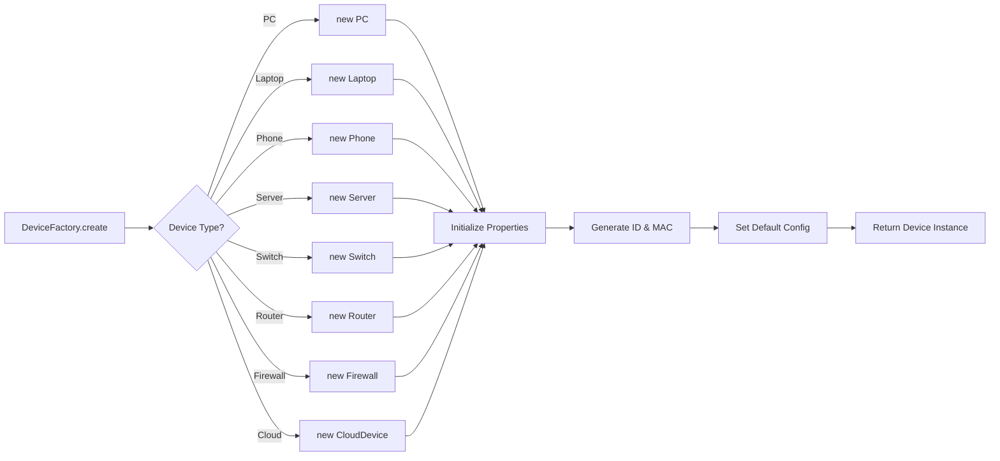

### DeviceFactory Class

**Purpose**: Create device instances based on type.

**Methods**:
- `static create(type: DeviceType, name: string, options?: DeviceOptions): Device` - Factory method
- `static fromJSON(json: DeviceJSON): Device` - Deserialize device from JSON

**Usage**:
```typescript
const pc = DeviceFactory.create(DeviceType.PC, "PC-1");
const switch1 = DeviceFactory.create(DeviceType.Switch, "Switch-1", { portCount: 8 });
```

---

## Design Principles

### 1. Single Responsibility
- Each class has one clear purpose
- Devices handle their own configuration and packet processing

### 2. Open/Closed Principle
- Base classes are closed for modification
- Subclasses extend behavior without modifying base classes

### 3. Liskov Substitution
- Any device can be used where Device is expected
- Subclasses maintain base class contracts

### 4. Polymorphism
- All devices implement `processPacket()` differently
- Same interface, different behavior

### 5. Encapsulation
- Internal state is private/protected
- Public methods provide controlled access

---

## Packet Flow Architecture

### Packet Flow Sequence Diagram

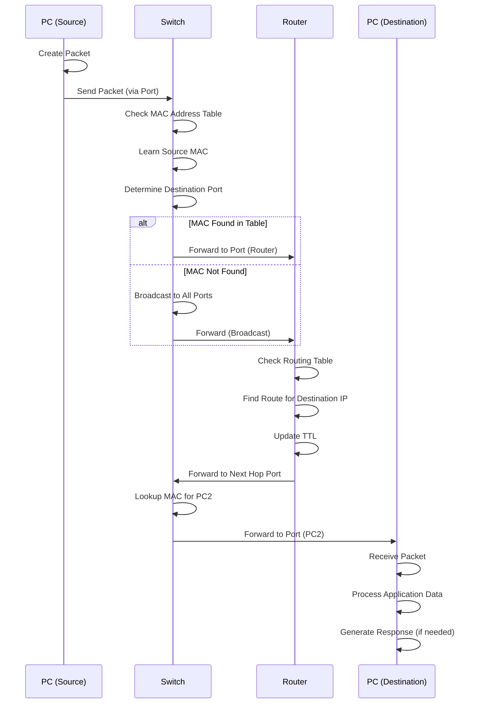

### Packet Flow Process Diagram

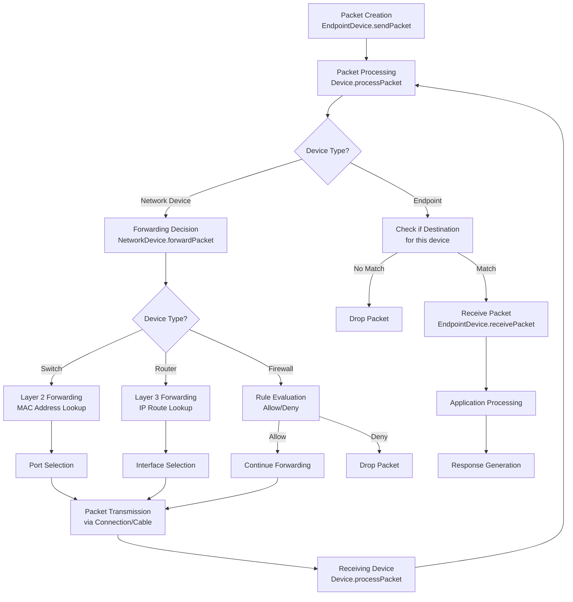

---

## Device State Management

### Device Status State Diagram

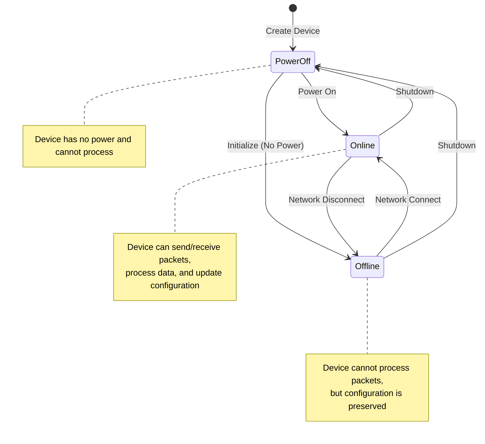

---

## Device Component Relationships

### Component Architecture Diagram

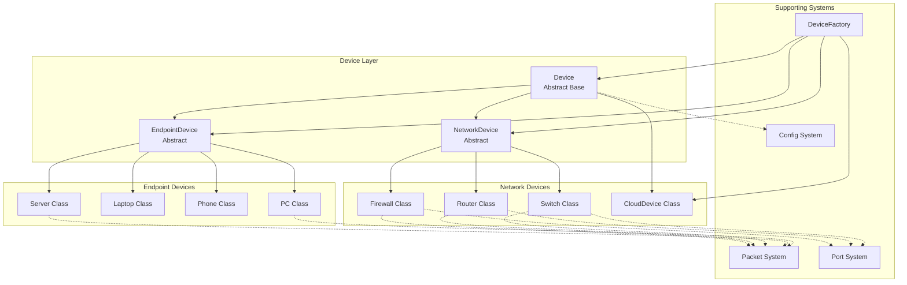

---

## Switch Packet Forwarding Logic

### Switch Decision Flow

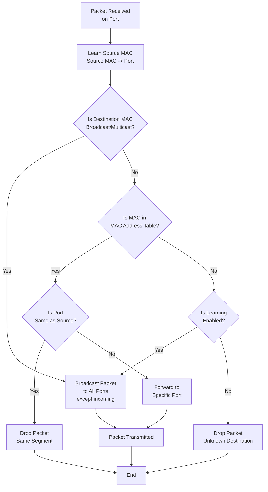

---

## Router Packet Routing Logic

### Router Routing Decision Flow

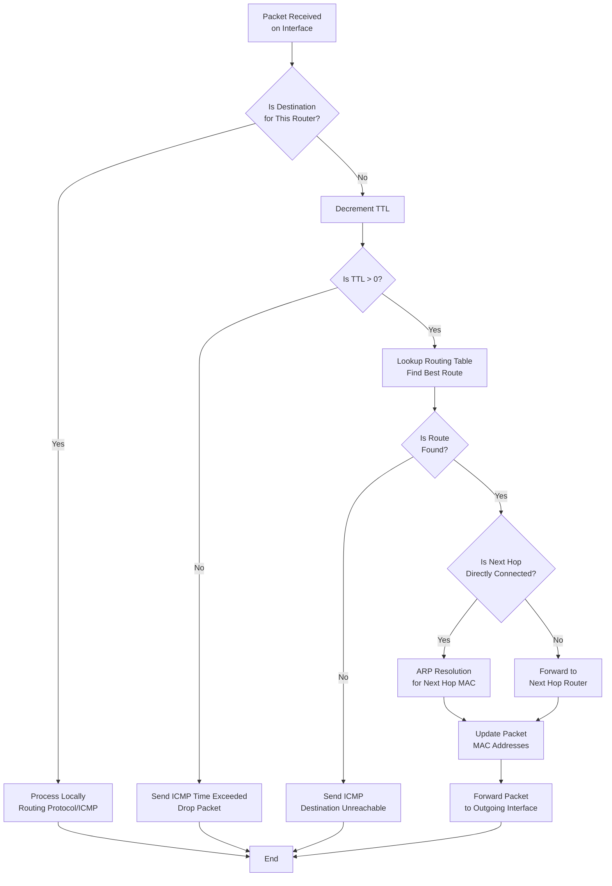

---

## Firewall Rule Evaluation

### Firewall Packet Filtering Flow

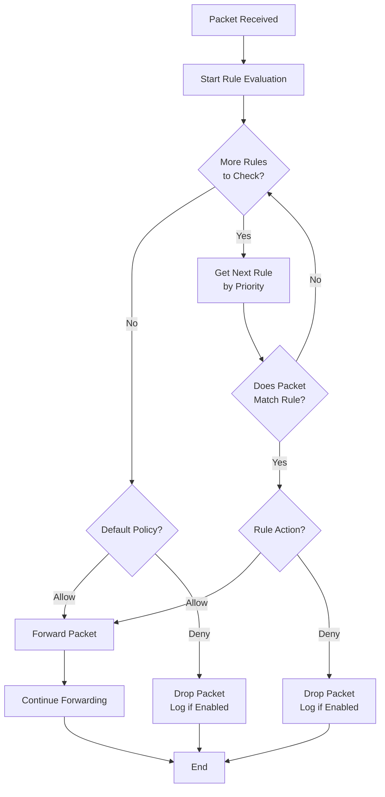

---

## Network Topology Example

### Example Network Topology Diagram

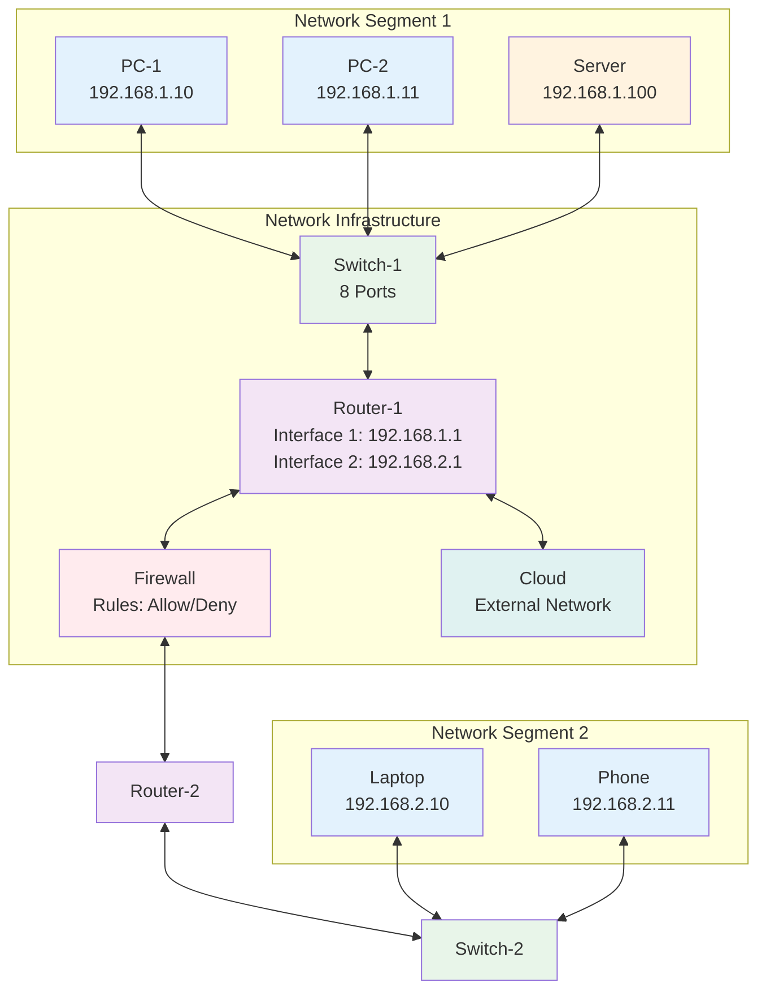

---

## ARP Resolution Sequence

### ARP Request/Response Flow

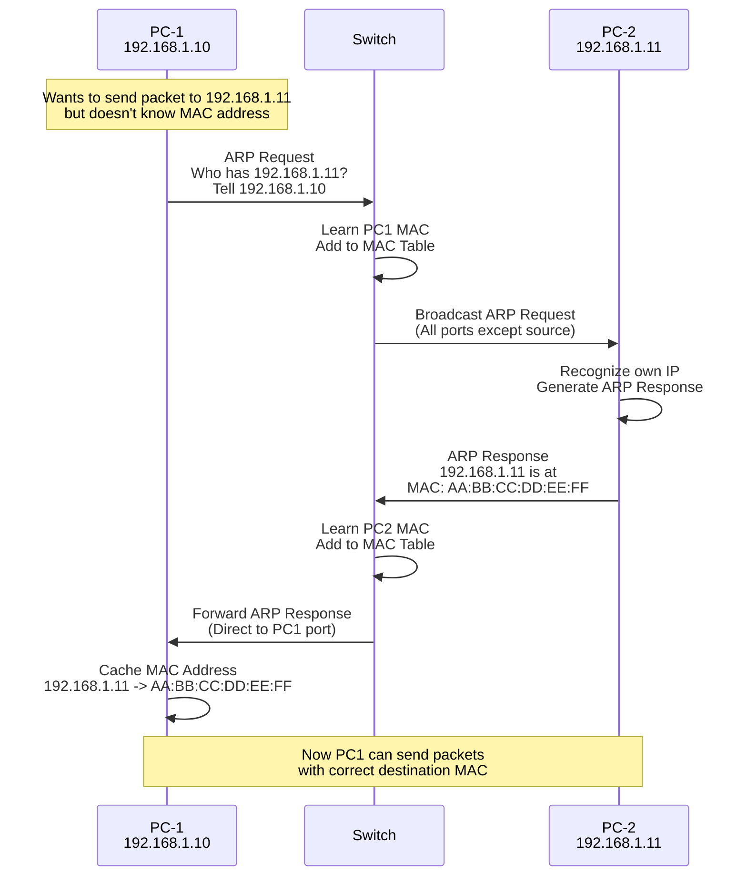

---

## Connection Model

### Connection Class (Future)

**Purpose**: Represents physical/logical connections between devices.

**Properties**:
- `id: string`
- `device1: Device`
- `port1: Port`
- `device2: Device`
- `port2: Port`
- `cableType: CableType`
- `status: ConnectionStatus`

---

## Configuration Management

### DeviceConfig Interface

Each device type has its own configuration interface:

```typescript
interface PCConfig {
  ipAddress: string;
  subnetMask: string;
  defaultGateway: string;
  dnsServers: string[];
}

interface SwitchConfig {
  ports: Port[];
  vlans: VLAN[];
  learningEnabled: boolean;
}

interface RouterConfig {
  interfaces: RouterInterface[];
  routingTable: Route[];
  enableNAT: boolean;
}

interface FirewallConfig {
  rules: FirewallRule[];
  defaultPolicy: FirewallPolicy;
}
```

---

## Serialization/Deserialization

All devices can be serialized to JSON for:
- Save/Load topologies
- Network state persistence
- Export/Import configurations

```typescript
interface DeviceJSON {
  id: string;
  type: DeviceType;
  name: string;
  config: DeviceConfig;
  position: { x: number, y: number };
  // ... other properties
}
```

---

## Testing Strategy

### Unit Tests
- Each device class tested independently
- Mock packet processing
- Configuration validation

### Integration Tests
- Multiple devices in a topology
- End-to-end packet flow
- Network simulation scenarios

---

## Future Extensions

1. **Cable/Connection Classes**: Physical connection representation
2. **Network Simulator Class**: Orchestrates device interactions
3. **Packet Generator**: Create test packets
4. **Network Analyzer**: Monitor and analyze traffic
5. **VLAN Management**: Advanced VLAN configuration
6. **Routing Protocols**: OSPF, BGP simulation
7. **Security Features**: Encryption, VPN tunnels

---

## File Structure

### Directory Structure Diagram

```mermaid
graph TD
    A[src/] --> B[devices/]
    A --> C[types/]
    A --> D[utils/]
    
    B --> B1[Device.ts<br/>Abstract Base]
    B --> B2[EndpointDevice.ts<br/>Abstract]
    B --> B3[NetworkDevice.ts<br/>Abstract]
    B --> B4[PC.ts]
    B --> B5[Laptop.ts]
    B --> B6[Phone.ts]
    B --> B7[Server.ts]
    B --> B8[Switch.ts]
    B --> B9[Router.ts]
    B --> B10[Firewall.ts]
    B --> B11[CloudDevice.ts]
    B --> B12[DeviceFactory.ts]
    B --> B13[index.ts<br/>Exports]
    
    C --> C1[device.types.ts<br/>Enums & Interfaces]
    C --> C2[packet.types.ts<br/>Packet Types]
    C --> C3[network.types.ts<br/>Network Types]
    C --> C4[index.ts]
    
    D --> D1[mac-generator.ts<br/>MAC Address Utils]
    D --> D2[ip-utils.ts<br/>IP Utilities]
    D --> D3[uuid.ts<br/>UUID Generation]
    
    style B fill:#e1f5ff
    style C fill:#fff4e1
    style D fill:#e8f5e9
```

### File Organization

```
src/
├── devices/
│   ├── Device.ts              # Abstract base class
│   ├── EndpointDevice.ts      # Abstract endpoint base
│   ├── NetworkDevice.ts       # Abstract network base
│   ├── PC.ts
│   ├── Laptop.ts
│   ├── Phone.ts
│   ├── Server.ts
│   ├── Switch.ts
│   ├── Router.ts
│   ├── Firewall.ts
│   ├── CloudDevice.ts
│   ├── DeviceFactory.ts
│   └── index.ts               # Exports
│
├── types/
│   ├── device.types.ts        # DeviceType enum, interfaces
│   ├── packet.types.ts        # Packet interfaces
│   ├── network.types.ts       # Network-related types
│   └── index.ts
│
└── utils/
    ├── mac-generator.ts       # Generate MAC addresses
    ├── ip-utils.ts            # IP address utilities
    └── uuid.ts                # UUID generation
```

---

## Questions for Review

1. **Device Hierarchy**: Does this inheritance structure make sense?
2. **Abstract vs Concrete**: Should we have more abstract intermediate classes?
3. **Configuration**: Are the config interfaces comprehensive enough?
4. **Packet Processing**: Is the packet flow architecture clear?
5. **Extensibility**: Will this structure allow for future device types?
6. **Port Management**: Is the port model adequate for switches/routers?
7. **Factory Pattern**: Should we use factory or builder pattern?

---

## System Design Considerations

This section covers important architectural considerations, design patterns, and best practices based on network simulator research and system design principles.

### 1. Event-Driven Architecture

**Pattern**: Observer + Mediator Pattern

**Purpose**: Decouple packet transmission from device processing, enable real-time updates, and support simulation event queue.

**Implementation**:

```typescript
// Event Bus for Network Events
interface NetworkEvent {
  type: 'packet_sent' | 'packet_received' | 'device_state_changed' | 'topology_updated';
  timestamp: Date;
  source: string; // Device ID
  data: any;
}

class EventBus {
  private subscribers: Map<string, Array<(event: NetworkEvent) => void>>;
  
  subscribe(eventType: string, callback: (event: NetworkEvent) => void): void;
  publish(event: NetworkEvent): void;
  unsubscribe(eventType: string, callback: Function): void;
}

// Observer Pattern for Device State Changes
interface DeviceObserver {
  onDeviceStateChanged(device: Device, oldState: DeviceStatus, newState: DeviceStatus): void;
  onPacketProcessed(device: Device, packet: Packet, result: Packet | null): void;
}
```

**Benefits**:
- Loose coupling between devices
- Real-time UI updates
- Simulation event queue management
- Easy debugging and logging
- Support for replay functionality

---

### 2. Command Pattern for Simulation

**Purpose**: Encapsulate simulation actions as objects, enabling undo/redo, replay, and simulation control.

**Implementation**:

```typescript
interface SimulationCommand {
  execute(): void;
  undo(): void;
  timestamp: Date;
}

class PacketTransmissionCommand implements SimulationCommand {
  constructor(
    private source: Device,
    private destination: Device,
    private packet: Packet
  ) {}
  
  execute(): void { /* Send packet */ }
  undo(): void { /* Reverse transmission */ }
}

class CommandHistory {
  private history: SimulationCommand[] = [];
  private currentIndex: number = -1;
  
  execute(command: SimulationCommand): void;
  undo(): void;
  redo(): void;
  canUndo(): boolean;
  canRedo(): boolean;
}
```

**Benefits**:
- Undo/Redo simulation steps
- Simulation replay
- Debugging and analysis
- Time-travel debugging

---

### 3. Performance and Scalability

#### 3.1. Object Pool Pattern

**Purpose**: Reuse Packet objects to reduce garbage collection overhead.

```typescript
class PacketPool {
  private pool: Packet[] = [];
  private maxSize: number;
  
  acquire(): Packet;
  release(packet: Packet): void;
  clear(): void;
}
```

#### 3.2. Spatial Indexing

**Purpose**: Efficient device lookup by position for visual rendering.

```typescript
class SpatialGrid {
  private grid: Map<string, Device[]>;
  private cellSize: number;
  
  insert(device: Device): void;
  query(region: BoundingBox): Device[];
  remove(device: Device): void;
}
```

#### 3.3. Batch Processing

**Purpose**: Process multiple packets in batches for better performance.

```typescript
class PacketProcessor {
  private queue: Packet[] = [];
  private batchSize: number = 100;
  
  enqueue(packet: Packet): void;
  processBatch(): void;
}
```

#### 3.4. Web Worker for Simulation

**Purpose**: Run simulation logic in a separate thread to avoid blocking UI.

```typescript
// Main Thread
const simulator = new Simulator();
simulator.runAsync().then(results => {
  updateUI(results);
});

// Web Worker Thread
class SimulatorWorker {
  processTopology(topology: Topology): SimulationResult;
  stepForward(): void;
  stepBackward(): void;
}
```

---

### 4. Error Handling and Resilience

#### 4.1. Result Type Pattern

**Purpose**: Type-safe error handling without exceptions.

```typescript
type Result<T, E = Error> = 
  | { success: true; data: T }
  | { success: false; error: E };

class Device {
  processPacket(packet: Packet): Result<Packet | null, ProcessingError>;
  configure(config: DeviceConfig): Result<void, ConfigurationError>;
}
```

#### 4.2. Circuit Breaker Pattern

**Purpose**: Prevent cascading failures in simulation.

```typescript
class CircuitBreaker {
  private failureCount: number = 0;
  private failureThreshold: number = 5;
  private state: 'closed' | 'open' | 'half-open';
  
  execute<T>(operation: () => T): Result<T, Error>;
  reset(): void;
}
```

#### 4.3. Validation Layer

**Purpose**: Validate configurations and packets before processing.

```typescript
interface Validator<T> {
  validate(value: T): ValidationResult;
}

class IPAddressValidator implements Validator<string> {
  validate(ip: string): ValidationResult {
    // Validate IP format, range, etc.
  }
}

class ConfigurationValidator {
  validateDeviceConfig(config: DeviceConfig): ValidationResult;
  validateTopology(topology: Topology): ValidationResult;
}
```

---

### 5. State Management

#### 5.1. Immutable State Pattern

**Purpose**: Prevent accidental mutations, enable time-travel debugging.

```typescript
interface TopologyState {
  devices: ReadonlyMap<string, Device>;
  connections: ReadonlyArray<Connection>;
  timestamp: Date;
}

class TopologyStore {
  private history: TopologyState[] = [];
  
  getState(): TopologyState;
  setState(newState: TopologyState): void;
  getHistory(): ReadonlyArray<TopologyState>;
}
```

#### 5.2. State Machine Pattern

**Purpose**: Manage device and simulation states explicitly.

```typescript
class DeviceStateMachine {
  private currentState: DeviceStatus;
  private transitions: Map<DeviceStatus, DeviceStatus[]>;
  
  canTransition(to: DeviceStatus): boolean;
  transition(to: DeviceStatus): Result<void, TransitionError>;
  getCurrentState(): DeviceStatus;
}
```

---

### 6. Caching Strategy

#### 6.1. Route Caching

**Purpose**: Cache routing decisions to avoid repeated calculations.

```typescript
class RouteCache {
  private cache: Map<string, Route>;
  private ttl: number = 60000; // 1 minute
  
  get(source: string, destination: string): Route | null;
  set(source: string, destination: string, route: Route): void;
  invalidate(deviceId: string): void;
  clear(): void;
}
```

#### 6.2. MAC Address Cache

**Purpose**: Cache ARP resolution results.

```typescript
class ARPCache {
  private cache: Map<string, string>; // IP -> MAC
  private ttl: number = 300000; // 5 minutes
  
  resolve(ipAddress: string): string | null;
  store(ipAddress: string, macAddress: string): void;
  invalidate(ipAddress: string): void;
}
```

---

### 7. Logging and Observability

#### 7.1. Structured Logging

**Purpose**: Consistent, queryable logs for debugging.

```typescript
interface LogEntry {
  level: 'debug' | 'info' | 'warn' | 'error';
  timestamp: Date;
  device?: string;
  event: string;
  data?: any;
  traceId?: string;
}

class Logger {
  debug(message: string, data?: any): void;
  info(message: string, data?: any): void;
  warn(message: string, data?: any): void;
  error(message: string, error: Error, data?: any): void;
}
```

#### 7.2. Metrics Collection

**Purpose**: Track simulation performance and statistics.

```typescript
interface SimulationMetrics {
  packetsProcessed: number;
  packetsDropped: number;
  averageLatency: number;
  throughput: number;
  deviceUtilization: Map<string, number>;
}

class MetricsCollector {
  recordPacketProcessed(device: string, latency: number): void;
  recordPacketDropped(device: string, reason: string): void;
  getMetrics(): SimulationMetrics;
  reset(): void;
}
```

---

### 8. Data Persistence

#### 8.1. Repository Pattern

**Purpose**: Abstract data storage layer.

```typescript
interface Repository<T> {
  save(entity: T): Promise<void>;
  findById(id: string): Promise<T | null>;
  findAll(): Promise<T[]>;
  delete(id: string): Promise<void>;
}

class DeviceRepository implements Repository<Device> {
  // IndexedDB or LocalStorage implementation
}
```

#### 8.2. Serialization Strategy

**Purpose**: Efficient serialization for save/load operations.

```typescript
interface Serializer<T> {
  serialize(entity: T): string;
  deserialize(data: string): T;
}

class TopologySerializer implements Serializer<Topology> {
  serialize(topology: Topology): string {
    return JSON.stringify(topology, null, 2);
  }
  
  deserialize(data: string): Topology {
    const json = JSON.parse(data);
    return this.reconstructTopology(json);
  }
}
```

---

### 9. Dependency Injection

**Purpose**: Loose coupling and testability.

```typescript
interface DependencyContainer {
  register<T>(key: string, factory: () => T): void;
  resolve<T>(key: string): T;
}

class DeviceFactory {
  constructor(
    private container: DependencyContainer,
    private logger: Logger,
    private metrics: MetricsCollector
  ) {}
  
  create(type: DeviceType, name: string): Device {
    // Use injected dependencies
  }
}
```

---

### 10. Testing Architecture

#### 10.1. Mock Objects

**Purpose**: Test devices in isolation.

```typescript
class MockDevice extends Device {
  private mockPackets: Packet[] = [];
  
  processPacket(packet: Packet): Packet | null {
    this.mockPackets.push(packet);
    return this.mockBehavior(packet);
  }
  
  getReceivedPackets(): ReadonlyArray<Packet> {
    return this.mockPackets;
  }
}
```

#### 10.2. Test Scenarios

**Purpose**: Reusable test scenarios.

```typescript
class TestScenario {
  constructor(
    private topology: Topology,
    private expectedResults: ExpectedResult[]
  ) {}
  
  execute(): TestResult;
  verify(): boolean;
}
```

---

### 11. Security Considerations

#### 11.1. Input Sanitization

**Purpose**: Prevent injection attacks and invalid data.

```typescript
class InputSanitizer {
  sanitizeIPAddress(input: string): string | null;
  sanitizeMACAddress(input: string): string | null;
  sanitizeDeviceName(input: string): string;
  validateTopologySize(topology: Topology): boolean;
}
```

#### 11.2. Resource Limits

**Purpose**: Prevent DoS attacks and memory exhaustion.

```typescript
class ResourceLimiter {
  private maxDevices: number = 1000;
  private maxConnections: number = 5000;
  private maxPacketSize: number = 65535;
  
  canAddDevice(): boolean;
  canAddConnection(): boolean;
  validatePacketSize(packet: Packet): boolean;
}
```

---

### 12. Concurrency and Async Processing

#### 12.1. Async Packet Processing

**Purpose**: Non-blocking packet processing.

```typescript
class AsyncPacketProcessor {
  private queue: AsyncQueue<Packet>;
  
  async processPacket(packet: Packet): Promise<Packet | null> {
    return this.queue.enqueue(() => 
      this.device.processPacket(packet)
    );
  }
}
```

#### 12.2. Promise-based APIs

**Purpose**: Modern async/await patterns.

```typescript
class NetworkSimulator {
  async runSimulation(
    topology: Topology,
    duration: number
  ): Promise<SimulationResult> {
    // Async simulation execution
  }
  
  async pause(): Promise<void>;
  async resume(): Promise<void>;
  async reset(): Promise<void>;
}
```

---

### 13. Extensibility Points

#### 13.1. Plugin Architecture

**Purpose**: Allow third-party extensions.

```typescript
interface DevicePlugin {
  name: string;
  version: string;
  install(simulator: NetworkSimulator): void;
  uninstall(simulator: NetworkSimulator): void;
}

class PluginManager {
  register(plugin: DevicePlugin): void;
  unregister(pluginName: string): void;
  getPlugin(name: string): DevicePlugin | null;
}
```

#### 13.2. Custom Device Types

**Purpose**: Allow users to create custom device types.

```typescript
interface CustomDeviceConfig {
  type: 'custom';
  name: string;
  behavior: DeviceBehavior;
  icon?: string;
}

class CustomDevice extends Device {
  constructor(config: CustomDeviceConfig) {
    // Initialize custom device
  }
}
```

---

### 14. Memory Management

#### 14.1. Weak References

**Purpose**: Allow garbage collection of unused devices.

```typescript
class DeviceRegistry {
  private devices: WeakMap<string, Device>;
  
  register(device: Device): void;
  get(id: string): Device | undefined;
}
```

#### 14.2. Memory Monitoring

**Purpose**: Track and limit memory usage.

```typescript
class MemoryMonitor {
  getMemoryUsage(): MemoryUsage;
  isMemoryThresholdExceeded(): boolean;
  cleanup(): void;
}
```

---

### 15. API Design

#### 15.1. Fluent Interface

**Purpose**: Readable, chainable API.

```typescript
class TopologyBuilder {
  addDevice(device: Device): this;
  connect(device1: Device, device2: Device): this;
  configure(device: Device, config: DeviceConfig): this;
  build(): Topology;
}

// Usage
const topology = new TopologyBuilder()
  .addDevice(pc1)
  .addDevice(switch1)
  .connect(pc1, switch1)
  .configure(pc1, pcConfig)
  .build();
```

#### 15.2. Builder Pattern for Complex Objects

**Purpose**: Construct complex configurations step by step.

```typescript
class RouterConfigBuilder {
  addInterface(interface: RouterInterface): this;
  addRoute(route: Route): this;
  enableNAT(): this;
  build(): RouterConfig;
}
```

---

### 16. Design Pattern Summary

| Pattern | Purpose | Location |
|---------|---------|----------|
| **Factory** | Device creation | DeviceFactory |
| **Observer** | Event notifications | EventBus |
| **Mediator** | Device communication | NetworkSimulator |
| **Command** | Simulation actions | CommandHistory |
| **Strategy** | Packet processing algorithms | Device.processPacket() |
| **State** | Device lifecycle | DeviceStateMachine |
| **Repository** | Data persistence | DeviceRepository |
| **Builder** | Complex configurations | TopologyBuilder |
| **Singleton** | Shared services | Logger, MetricsCollector |
| **Object Pool** | Performance optimization | PacketPool |
| **Decorator** | Extended functionality | Device plugins |
| **Proxy** | Access control | Device access layer |

---

### 17. Performance Optimization Checklist

- [ ] Implement object pooling for frequently created objects (Packets)
- [ ] Use spatial indexing for device position queries
- [ ] Batch process packets in groups
- [ ] Use Web Workers for heavy computation
- [ ] Implement caching for routing decisions
- [ ] Use weak references for temporary objects
- [ ] Lazy load device configurations
- [ ] Debounce/throttle UI updates
- [ ] Virtual scrolling for large device lists
- [ ] Memory leak detection and cleanup

---

### 18. Scalability Considerations

#### 18.1. Horizontal Scaling (Future)

- Partition topology into sub-topologies
- Distribute simulation across multiple workers
- Use message passing for inter-worker communication

#### 18.2. Vertical Scaling

- Optimize algorithms (O(n) → O(log n))
- Reduce memory footprint
- Optimize rendering pipeline

---

### 19. Monitoring and Debugging

#### 19.1. Debug Mode

```typescript
class Debugger {
  breakpoint(device: Device, condition: (packet: Packet) => boolean): void;
  inspect(device: Device): DeviceState;
  trace(packet: Packet): PacketTrace[];
  stepForward(): void;
  stepBackward(): void;
}
```

#### 19.2. Visualization Tools

- Real-time packet flow visualization
- Network topology graph
- Device state inspector
- Performance metrics dashboard
- Packet capture viewer

---

### 20. Documentation Requirements

- [ ] API documentation (JSDoc/TSDoc)
- [ ] Architecture decision records (ADRs)
- [ ] User guide
- [ ] Developer guide
- [ ] Performance tuning guide
- [ ] Testing guide
- [ ] Contributing guidelines

---

## User Experience (UX) Design Philosophy

### Core Principles

1. **Zero Syntax Required** - No command-line knowledge needed
2. **Visual-First Approach** - Everything is drag-and-drop and visual
3. **Plug-and-Play Configuration** - Smart defaults with optional customization
4. **Progressive Disclosure** - Simple first, advanced features available when needed
5. **Instant Feedback** - Real-time validation and visual indicators
6. **Guided Experience** - Helpful tooltips, wizards, and suggestions

---

## User Interface Architecture

### 1. Visual Network Builder

#### 1.1. Drag-and-Drop Canvas

**Interface Design**:
- **Left Sidebar**: Device palette with visual icons
- **Center Canvas**: Infinite scrollable canvas for network topology
- **Right Panel**: Device configuration panel (appears on device selection)
- **Top Toolbar**: Actions (Save, Load, Export, Run Simulation, etc.)

```typescript
interface NetworkCanvas {
  // Canvas properties
  zoom: number;
  panOffset: { x: number; y: number };
  gridEnabled: boolean;
  snapToGrid: boolean;
  
  // Interaction handlers
  onDeviceDrag(device: Device, position: Position): void;
  onDeviceDrop(device: Device, position: Position): void;
  onDeviceClick(device: Device): void;
  onDeviceDoubleClick(device: Device): void;
  onConnectionStart(device: Device, port: Port): void;
  onConnectionEnd(device: Device, port: Port): void;
}
```

**User Flow**:
1. User drags device icon from palette
2. Device appears on canvas at drop location
3. Device automatically gets a default name (e.g., "PC-1", "Switch-1")
4. User can immediately connect devices or configure them

---

### 2. Form-Based Configuration (No CLI)

#### 2.1. Configuration Panel Design

**Principles**:
- **No Syntax** - All inputs are form fields, dropdowns, toggles
- **Smart Defaults** - Pre-filled values that work out of the box
- **Visual Feedback** - Real-time validation with helpful error messages
- **Contextual Help** - Tooltips explaining each field

#### 2.2. PC/Endpoint Device Configuration

**Simple Mode (Default)**:
```
┌─────────────────────────────────┐
│ Configure PC-1                  │
├─────────────────────────────────┤
│ Device Name: [PC-1        ]    │
│                                 │
│ Network Settings:               │
│   ☑ Auto-configure IP Address   │
│                                 │
│   Or configure manually:        │
│   IP Address:    [192.168.1.10] │
│   Subnet Mask:   [255.255.255.0]│
│   Gateway:       [192.168.1.1]  │
│                                 │
│   [Advanced Options ▼]          │
│                                 │
│   [Save]  [Cancel]              │
└─────────────────────────────────┘
```

**Advanced Mode (Optional)**:
- DNS servers
- Static routes
- MAC address override
- Interface settings

**Implementation**:
```typescript
interface EndpointDeviceConfigForm {
  // Simple mode fields
  deviceName: string;
  autoConfigureIP: boolean;
  
  // Manual configuration (shown when autoConfigureIP is false)
  ipAddress?: string;
  subnetMask?: string;
  defaultGateway?: string;
  
  // Advanced options (collapsed by default)
  advancedOptions?: {
    dnsServers: string[];
    staticRoutes: Route[];
    customMACAddress?: string;
  };
}

class EndpointConfigForm extends React.Component {
  // Auto-suggests IP based on network
  suggestIPAddress(network: string): string;
  
  // Validates input in real-time
  validateInput(): ValidationResult;
  
  // Shows helpful error messages
  getErrorMessage(field: string): string | null;
}
```

---

#### 2.3. Switch Configuration

**Simple Mode (Default)**:
```
┌─────────────────────────────────┐
│ Configure Switch-1              │
├─────────────────────────────────┤
│ Device Name: [Switch-1     ]    │
│                                 │
│ Port Configuration:             │
│   Number of Ports: [8      ▼]   │
│                                 │
│   Port Status:                  │
│   Port 1: [●] Up                │
│   Port 2: [●] Up                │
│   ...                           │
│                                 │
│   ☑ Enable MAC Learning         │
│                                 │
│   [Advanced: VLANs ▼]           │
│                                 │
│   [Save]  [Cancel]              │
└─────────────────────────────────┘
```

**Key Features**:
- Visual port status indicators (green = up, red = down, gray = disabled)
- Click port to configure individual port settings
- VLAN configuration only shown if user expands "Advanced"
- Auto-learns MAC addresses (default enabled)

---

#### 2.4. Router Configuration

**Simple Mode - Visual Interface Approach**:
```
┌─────────────────────────────────┐
│ Configure Router-1              │
├─────────────────────────────────┤
│ Device Name: [Router-1     ]    │
│                                 │
│ Interface Configuration:        │
│ ┌─────────────────────────────┐ │
│ │ Interface 1 (FastEthernet0/0)│ │
│ │   [●] Enabled                │ │
│ │   IP: [192.168.1.1    ]     │ │
│ │   Mask: [255.255.255.0 ▼]   │ │
│ │   [Edit] [Delete]            │ │
│ └─────────────────────────────┘ │
│                                 │
│ [+ Add Interface]               │
│                                 │
│ Routing:                        │
│   ☑ Enable Static Routing      │
│                                 │
│   [Add Route +]                 │
│   (Routes shown as visual cards)│
│                                 │
│   [Save]  [Cancel]              │
└─────────────────────────────────┘
```

**Route Configuration (Visual)**:
- Card-based interface for routes
- Dropdown for destination network (suggests common networks)
- Auto-suggests gateway based on connected interfaces
- Visual route table view

---

#### 2.5. Firewall Configuration

**Simple Mode - Rule Builder**:
```
┌─────────────────────────────────┐
│ Configure Firewall-1            │
├─────────────────────────────────┤
│ Device Name: [Firewall-1  ]     │
│                                 │
│ Default Policy:                 │
│   ( ) Allow All                 │
│   (●) Deny All                  │
│                                 │
│ Firewall Rules:                 │
│ ┌─────────────────────────────┐ │
│ │ Rule 1: Allow               │ │
│ │ From: Any → To: 192.168.1.0 │ │
│ │ Port: 80, 443                │ │
│ │ [Edit] [Delete]              │ │
│ └─────────────────────────────┘ │
│                                 │
│ [+ Add Rule]                    │
│                                 │
│ Rule Builder (when adding):     │
│   Action: [Allow ▼]             │
│   Source: [Any ▼] or [IP...]    │
│   Destination: [IP Address...]  │
│   Port: [80, 443        ]       │
│   Protocol: [TCP ▼]             │
│                                 │
│   [Add Rule]  [Cancel]          │
└─────────────────────────────────┘
```

**Key Features**:
- Visual rule builder with dropdowns (no syntax)
- Pre-filled common rules (HTTP, HTTPS, SSH, etc.)
- Rule priority shown visually
- Test rule button to verify

---

### 3. Connection Management

#### 3.1. Visual Connection Tool

**User Flow**:
1. User selects "Connect" tool from toolbar
2. User clicks on source device
3. Visual port selector appears (if device has multiple ports)
4. User selects source port
5. User clicks destination device
6. Visual port selector appears
7. User selects destination port
8. Connection line appears with animation
9. Connection is automatically validated

**Visual Feedback**:
- Hover over device shows available ports
- Ports highlight when hoverable
- Invalid connections show error message
- Valid connections show success indicator

```typescript
interface ConnectionWizard {
  step: 'select-source' | 'select-destination' | 'configure';
  sourceDevice?: Device;
  sourcePort?: Port;
  destinationDevice?: Device;
  destinationPort?: Port;
  
  // Auto-suggests cable type based on devices
  suggestCableType(): CableType;
  
  // Validates connection before creating
  validateConnection(): ValidationResult;
  
  // Shows helpful error if invalid
  getConnectionError(): string | null;
}
```

---

### 4. Smart Configuration Wizards

#### 4.1. Quick Setup Wizard

**First-Time User Experience**:
```
┌──────────────────────────────────────┐
│  Welcome to Network Simulator!       │
│                                      │
│  Let's set up your first network:    │
│                                      │
│  Step 1/3: Choose Template           │
│  ┌────────────────────────────────┐  │
│  │ [📱] Home Network              │  │
│  │     PC, Router, Modem          │  │
│  └────────────────────────────────┘  │
│  ┌────────────────────────────────┐  │
│  │ [🏢] Small Office              │  │
│  │     PCs, Switch, Router        │  │
│  └────────────────────────────────┘  │
│  ┌────────────────────────────────┐  │
│  │ [☁️] Start from Scratch        │  │
│  └────────────────────────────────┘  │
│                                      │
│  [Next →]                            │
└──────────────────────────────────────┘
```

#### 4.2. Template-Based Setup

**Pre-configured Templates**:
- **Home Network**: Router → Switch → PCs
- **Small Office**: Router → Firewall → Switch → Multiple PCs
- **Server Network**: Router → Switch → Server + Clients
- **Learning Lab**: Multiple routers with subnets

**Template Features**:
- Pre-placed devices
- Pre-configured IP ranges
- Pre-connected devices
- User can modify everything after setup

---

### 5. Auto-Configuration Features

#### 5.1. Intelligent IP Assignment

**When user connects devices, automatically**:
- Suggests IP address ranges based on network
- Auto-assigns sequential IPs (192.168.1.10, 192.168.1.11, ...)
- Auto-configures subnet masks
- Auto-suggests gateway (usually router)

```typescript
class AutoConfigurator {
  // Analyzes topology and suggests IP configuration
  suggestIPConfiguration(device: EndpointDevice): IPConfig {
    const network = this.analyzeNetwork(device);
    const availableIP = this.findAvailableIP(network);
    return {
      ipAddress: availableIP,
      subnetMask: network.subnetMask,
      gateway: network.gateway,
    };
  }
  
  // Auto-configures device when connected
  autoConfigureDevice(device: EndpointDevice): void {
    const config = this.suggestIPConfiguration(device);
    device.configure(config);
  }
}
```

#### 5.2. Smart Routing

**When router is added**:
- Auto-discovers connected networks
- Suggests routes based on topology
- User can accept/reject/modify suggestions

#### 5.3. Port Auto-Detection

**When connecting devices**:
- Auto-detects available ports
- Suggests best port (unused, compatible)
- Shows port status visually

---

### 6. Validation and Error Handling

#### 6.1. Real-Time Validation

**As user types/configures**:
- Immediate feedback on invalid inputs
- Visual indicators (red border for errors)
- Helpful error messages

**Error Message Examples**:
- ❌ "Invalid IP address format. Use format: 192.168.1.1"
- ❌ "IP address already in use by PC-2"
- ❌ "Subnet mask doesn't match network 192.168.1.0/24"
- ✅ "Configuration looks good!"

```typescript
interface ValidationRule {
  field: string;
  validator: (value: any) => ValidationResult;
  errorMessage: string;
}

class ConfigValidator {
  validateIPAddress(ip: string): ValidationResult {
    if (!this.isValidIPFormat(ip)) {
      return {
        valid: false,
        error: "Invalid IP address format. Use format: 192.168.1.1"
      };
    }
    if (this.isIPInUse(ip)) {
      return {
        valid: false,
        error: `IP address already in use by ${this.getDeviceUsingIP(ip)}`
      };
    }
    return { valid: true };
  }
  
  validateTopology(topology: Topology): ValidationResult {
    // Checks for:
    // - Isolated devices (not connected)
    // - IP conflicts
    // - Routing issues
    // - Invalid connections
  }
}
```

#### 6.2. Visual Error Indicators

- **Red outline**: Invalid input
- **Yellow warning**: Potential issue
- **Green checkmark**: Valid configuration
- **Info icon**: Helpful hint

---

### 7. Progressive Disclosure

#### 7.1. Simple → Advanced

**Default View (Simple)**:
- Essential settings only
- Smart defaults applied
- "Show Advanced" toggle at bottom

**Advanced View (Optional)**:
- All configuration options
- Expert-level settings
- Detailed network parameters

```typescript
interface ConfigPanel {
  mode: 'simple' | 'advanced';
  
  // Simple mode shows only essential fields
  getSimpleFields(): ConfigField[];
  
  // Advanced mode shows all fields
  getAdvancedFields(): ConfigField[];
  
  toggleMode(): void;
}
```

---

### 8. Configuration Presets

#### 8.1. Quick Presets

**For Common Scenarios**:
```
┌─────────────────────────────────┐
│ Quick Configuration             │
├─────────────────────────────────┤
│ Choose a preset:                │
│                                 │
│ [ ] DHCP Client (Auto IP)       │
│ [●] Static IP                   │
│ [ ] Server Configuration        │
│ [ ] Guest Network               │
│                                 │
│ Or configure manually below     │
└─────────────────────────────────┘
```

#### 8.2. Device-Specific Presets

**PC/Laptop/Phone**:
- Home Network
- Office Network
- Public WiFi
- Custom

**Server**:
- Web Server
- File Server
- Database Server
- Custom

**Router**:
- Home Router
- Office Gateway
- DMZ Router
- Custom

---

### 9. Visual Feedback and Indicators

#### 9.1. Device Status Indicators

**Visual Status**:
- 🟢 **Green**: Online and operational
- 🟡 **Yellow**: Warning or degraded
- 🔴 **Red**: Offline or error
- ⚪ **Gray**: Powered off

#### 9.2. Connection Status

**Visual Indicators**:
- **Solid line**: Active connection
- **Dashed line**: Inactive/disabled
- **Animated line**: Packet transmission in progress
- **Color-coded**: By VLAN or network segment

#### 9.3. Configuration Status

**Visual Indicators**:
- ✅ **Configured**: All required settings complete
- ⚠️ **Warning**: Missing optional settings
- ❌ **Error**: Invalid or incomplete configuration
- 🔄 **Auto-configured**: Smart defaults applied

---

### 10. Help and Guidance

#### 10.1. Contextual Tooltips

**Hover over any field/button**:
- Brief explanation
- Example values
- Link to detailed help

#### 10.2. Inline Help

**Example**:
```
IP Address: [192.168.1.10          ]
            └─ ℹ️ This is the device's network address.
               It must be unique on your network.
```

#### 10.3. Interactive Tutorials

**First-time users**:
- Step-by-step guided tour
- Highlights important features
- Can be skipped or repeated

#### 10.4. Example Scenarios

**Pre-built Examples**:
- Basic Home Network
- Office with Multiple Subnets
- Server Network
- Complex Routing Scenario

**Users can**:
- Load example
- See how it's configured
- Modify it
- Learn by example

---

### 11. Configuration Forms Design

#### 11.1. Form Structure

**Standard Form Layout**:
```
┌─────────────────────────────────────┐
│ [Device Icon] Device Name           │
├─────────────────────────────────────┤
│                                     │
│ Section 1: Basic Settings           │
│ ───────────────────────────────     │
│ Field 1: [input field]     [ℹ️]     │
│ Field 2: [dropdown ▼]      [ℹ️]     │
│                                     │
│ Section 2: Network Settings         │
│ ───────────────────────────────     │
│ Field 3: [input field]     [ℹ️]     │
│                                     │
│ [Advanced Options ▼]                │
│                                     │
│ [Save] [Cancel] [Reset to Defaults] │
└─────────────────────────────────────┘
```

#### 11.2. Input Types

**Form Controls Used**:
- **Text Input**: For names, IP addresses (with validation)
- **Dropdown**: For predefined options
- **Toggle Switch**: For on/off settings
- **Number Input**: For ports, metrics (with min/max)
- **Multi-select**: For multiple options
- **Color Picker**: For visual customization
- **File Upload**: For importing configurations

#### 11.3. Input Validation

**Real-time Validation**:
```typescript
interface FormField {
  name: string;
  label: string;
  type: 'text' | 'number' | 'select' | 'toggle' | 'multiselect';
  placeholder?: string;
  helpText?: string;
  validator?: (value: any) => ValidationResult;
  defaultValue?: any;
  required?: boolean;
  
  // Auto-complete suggestions
  suggestions?: (input: string) => string[];
}
```

---

### 12. Configuration Workflow

#### 12.1. Typical User Journey

```
1. Create Network Topology
   ├─ Drag devices onto canvas
   ├─ Connect devices visually
   └─ Devices auto-configured with defaults

2. Configure Devices (Optional)
   ├─ Click device to open config panel
   ├─ Modify settings in simple form
   └─ Real-time validation feedback

3. Test Network
   ├─ Click "Run Simulation"
   ├─ Send test packet (ping)
   └─ View packet flow visually

4. Save/Export
   ├─ Save to local storage
   └─ Export as JSON file
```

#### 12.2. Zero-Configuration Mode

**Users can build and test without any configuration**:
- Devices get auto-assigned IPs
- Connections are auto-configured
- Network works immediately
- Users can customize later if needed

---

### 13. Visual Configuration Interfaces

#### 13.1. Switch Port Configuration

**Visual Port Grid**:
```
┌─────────────────────────────────┐
│ Switch Ports                    │
├─────────────────────────────────┤
│ Port 1: [🟢] Connected to PC-1  │
│ Port 2: [⚪] Available           │
│ Port 3: [🟢] Connected to PC-2  │
│ Port 4: [🔴] Disabled           │
│ ...                             │
│                                 │
│ Click port to configure         │
└─────────────────────────────────┘
```

#### 13.2. Router Interface Configuration

**Visual Interface Cards**:
```
┌─────────────────────────────────┐
│ Router Interfaces               │
├─────────────────────────────────┤
│ ┌─────────────────────────────┐ │
│ │ Interface 1                 │ │
│ │ Status: 🟢 Up               │ │
│ │ IP: 192.168.1.1/24         │ │
│ │ Connected: Switch-1        │ │
│ │ [Configure]                 │ │
│ └─────────────────────────────┘ │
│                                 │
│ [+ Add Interface]               │
└─────────────────────────────────┘
```

#### 13.3. Firewall Rules Table

**Visual Rule Management**:
```
┌─────────────────────────────────┐
│ Firewall Rules                  │
├─────────────────────────────────┤
│ ┌─────────────────────────────┐ │
│ │ Allow │ Any → Web Server    │ │
│ │ Ports: 80, 443              │ │
│ │ [↑] [↓] [Edit] [🗑️]        │ │
│ └─────────────────────────────┘ │
│ ┌─────────────────────────────┐ │
│ │ Deny  │ 10.0.0.0 → Any      │ │
│ │ All Ports                   │ │
│ │ [↑] [↓] [Edit] [🗑️]        │ │
│ └─────────────────────────────┘ │
│                                 │
│ [+ Add Rule]                    │
└─────────────────────────────────┘
```

---

### 14. Smart Defaults and Auto-Suggestions

#### 14.1. Intelligent Defaults

**Device Creation**:
- Auto-generate unique names (PC-1, PC-2, Switch-1, ...)
- Auto-assign sequential IPs
- Auto-configure based on network context
- Auto-enable essential features

#### 14.2. Smart Suggestions

**IP Address Suggestions**:
- Suggests next available IP in subnet
- Warns about IP conflicts
- Suggests common network ranges

**Gateway Suggestions**:
- Auto-detects routers on network
- Suggests router's interface IP

**Port Suggestions**:
- Suggests available ports when connecting
- Highlights compatible ports

---

### 15. Configuration Templates Library

#### 15.1. Pre-built Templates

**Network Templates**:
- **Basic Home Network**: Router → Switch → 2 PCs
- **Small Office**: Router → Firewall → Switch → Multiple PCs + Server
- **Multi-Subnet Network**: Router → Multiple Switches → Devices
- **DMZ Network**: Router → Firewall → DMZ Switch + Internal Switch
- **Learning Lab**: Multiple Routers with Complex Routing

**Device Templates**:
- **Web Server**: Pre-configured HTTP/HTTPS ports
- **File Server**: Pre-configured SMB/FTP ports
- **Database Server**: Pre-configured SQL ports
- **Mail Server**: Pre-configured SMTP/IMAP ports

#### 15.2. Template System

```typescript
interface NetworkTemplate {
  name: string;
  description: string;
  category: 'home' | 'office' | 'lab' | 'custom';
  thumbnail: string;
  
  topology: Topology;
  configurations: Map<string, DeviceConfig>;
  
  // Template metadata
  difficulty: 'beginner' | 'intermediate' | 'advanced';
  estimatedTime: number; // minutes
  learningObjectives: string[];
}

class TemplateLibrary {
  getTemplates(category?: string): NetworkTemplate[];
  loadTemplate(templateId: string): NetworkTemplate;
  createTemplateFromTopology(topology: Topology): NetworkTemplate;
}
```

---

### 16. User Onboarding Flow

#### 16.1. First Launch Experience

```
┌──────────────────────────────────────┐
│  Welcome to Network Simulator! 🎉    │
│                                      │
│  Build, configure, and simulate      │
│  network topologies visually.        │
│                                      │
│  ┌────────────────────────────────┐  │
│  │ [📖] Take a Quick Tour         │  │
│  │     (2 minutes)                │  │
│  └────────────────────────────────┘  │
│  ┌────────────────────────────────┐  │
│  │ [🚀] Start with Template       │  │
│  │     Pre-built networks         │  │
│  └────────────────────────────────┘  │
│  ┌────────────────────────────────┐  │
│  │ [✨] Start from Scratch        │  │
│  │     Build your own network     │  │
│  └────────────────────────────────┘  │
│                                      │
│  [Skip]                               │
└──────────────────────────────────────┘
```

#### 16.2. Interactive Tutorial

**Step-by-step guidance**:
1. "Drag a PC from the palette"
2. "Now drag a switch"
3. "Click the connect tool and connect them"
4. "Click the PC to configure it"
5. "Try sending a test packet!"

---

### 17. Error Prevention and Recovery

#### 17.1. Prevent Errors Before They Happen

**Design Choices**:
- Disable invalid options in dropdowns
- Gray out unavailable actions
- Show warnings before destructive actions
- Confirm before deleting

#### 17.2. Helpful Error Recovery

**When Errors Occur**:
- Clear, actionable error messages
- "Fix It" button with suggested solution
- Undo/Redo for accidental changes
- Auto-save for recovery

**Example Error Messages**:
```
❌ Configuration Error

IP Address conflict detected!

PC-1 and PC-2 both have IP: 192.168.1.10

[Fix Automatically]  [Let me fix it]
```

---

### 18. Configuration Export/Import

#### 18.1. Visual Export Options

**Export Formats**:
- **JSON File**: For sharing and backup
- **Image**: Network diagram
- **PDF Report**: Configuration summary

#### 18.2. Import with Validation

**Import Features**:
- Drag-and-drop JSON file
- Validate imported configuration
- Show conflicts/warnings
- Preview before applying

---

### 19. Responsive Design

#### 19.1. Mobile/Tablet Support

**Adaptive Layout**:
- Collapsible sidebars
- Touch-friendly controls
- Simplified configuration on small screens
- Full features on desktop

#### 19.2. Accessibility

**Features**:
- Keyboard navigation
- Screen reader support
- High contrast mode
- Font size adjustment

---

### 20. UX Design Principles Summary

| Principle | Implementation |
|-----------|---------------|
| **Zero Syntax** | Form-based inputs only, no command-line |
| **Visual First** | Drag-and-drop, visual indicators |
| **Smart Defaults** | Auto-configuration, intelligent suggestions |
| **Progressive Disclosure** | Simple mode default, advanced optional |
| **Instant Feedback** | Real-time validation, visual status |
| **Contextual Help** | Tooltips, inline help, examples |
| **Error Prevention** | Disable invalid options, warnings |
| **Forgiving Interface** | Undo/redo, auto-save, easy recovery |
| **Guided Experience** | Wizards, tutorials, templates |
| **Consistent Patterns** | Same form structure across devices |

---

### 21. Configuration UI Components

#### 21.1. Reusable Form Components

```typescript
// IP Address Input with validation
<IPAddressInput
  value={ipAddress}
  onChange={setIPAddress}
  network="192.168.1.0/24"
  showSuggestions={true}
  helpText="Device's network address"
/>

// Port Selector with visual indicators
<PortSelector
  device={switch}
  selectedPort={port}
  onSelect={setPort}
  showStatus={true}
/>

// Rule Builder for Firewall
<RuleBuilder
  rule={rule}
  onChange={setRule}
  presets={commonRules}
/>

// Network Range Picker
<NetworkRangePicker
  value={networkRange}
  onChange={setNetworkRange}
  suggestions={commonRanges}
/>
```

---

### 22. User Testing Considerations

#### 22.1. Target User Personas

**Primary Users**:
- **Students**: Learning networking basics
- **Educators**: Teaching network concepts
- **IT Professionals**: Prototyping networks

**User Goals**:
- Learn network concepts visually
- Test network configurations
- Understand packet flow
- Design network topologies

#### 22.2. Usability Goals

**Success Metrics**:
- User can build basic network in < 5 minutes
- User can configure device without documentation
- User understands error messages
- User can recover from mistakes easily

---

**Please review and approve this architecture before implementation begins.**
