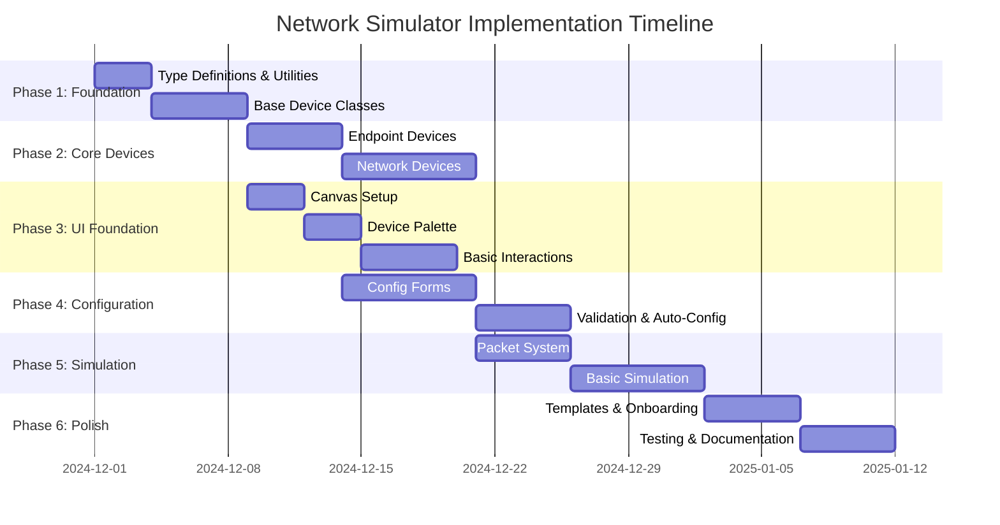
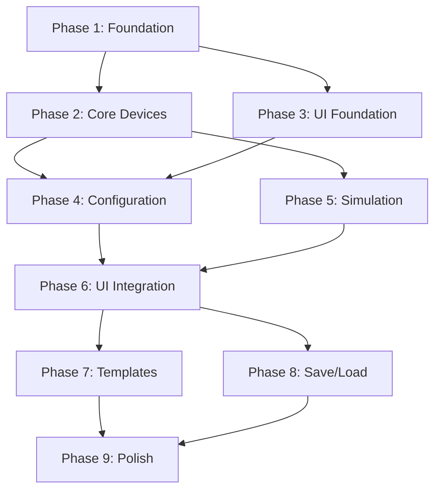

# Network Simulator - Implementation Plan

## Overview

This document outlines the phased, sprint-by-sprint implementation plan for the Network Simulator project. Each phase builds upon the previous one, ensuring a systematic and testable development approach.

---

## Implementation Phases Overview

---

## Phase 1: Foundation (Sprints 1-2)

**Goal**: Set up project structure, types, utilities, and base classes.

### Sprint 1: Project Setup & Type Definitions

**Duration**: 3-5 days

**Deliverables**:
- [x] Next.js project setup ✅
- [ ] Type definitions and interfaces
- [ ] Utility functions (UUID, MAC generator, IP utils)
- [ ] Enums (DeviceType, DeviceStatus, etc.)

**Tasks**:

1. **Create Type Definitions**
   - [ ] `src/types/device.types.ts` - DeviceType enum, DeviceConfig interfaces
   - [ ] `src/types/packet.types.ts` - Packet interface and related types
   - [ ] `src/types/network.types.ts` - Network interfaces, Port, Route, etc.
   - [ ] `src/types/index.ts` - Export all types

2. **Create Utility Functions**
   - [ ] `src/utils/uuid.ts` - UUID generation
   - [ ] `src/utils/mac-generator.ts` - MAC address generation
   - [ ] `src/utils/ip-utils.ts` - IP address validation and utilities
   - [ ] `src/utils/validation.ts` - Input validation helpers

3. **Project Configuration**
   - [ ] Set up path aliases (`@/*`)
   - [ ] Configure ESLint rules
   - [ ] Set up testing framework (Vitest)

**Definition of Done**:
- All type definitions created and exported
- Utility functions have unit tests
- No TypeScript errors
- Can import and use types/utils in other files

---

### Sprint 2: Base Device Classes

**Duration**: 5-7 days

**Deliverables**:
- Abstract Device base class
- DeviceFactory class
- Basic serialization/deserialization

**Tasks**:

1. **Create Abstract Device Class**
   - [ ] `src/devices/Device.ts` - Abstract base class
     - Properties (id, name, type, position, macAddress, status)
     - Abstract methods (configure, getConfiguration, processPacket)
     - Concrete methods (toJSON, fromJSON, getInfo)

2. **Create Device Factory**
   - [ ] `src/devices/DeviceFactory.ts` - Factory pattern implementation
     - `create()` method
     - `fromJSON()` method

3. **Create Device Exports**
   - [ ] `src/devices/index.ts` - Export all device classes

4. **Unit Tests**
   - [ ] Test Device base class
   - [ ] Test DeviceFactory
   - [ ] Test serialization/deserialization

**Definition of Done**:
- Device base class implemented with all abstract methods
- DeviceFactory can create device instances
- Devices can be serialized to/from JSON
- All tests passing

---

## Phase 2: Core Device Implementation (Sprints 3-5)

**Goal**: Implement all device classes (endpoint and network devices).

### Sprint 3: Endpoint Devices

**Duration**: 5-7 days

**Deliverables**:
- EndpointDevice abstract class
- PC, Laptop, Phone, Server classes

**Tasks**:

1. **Create EndpointDevice Abstract Class**
   - [ ] `src/devices/EndpointDevice.ts`
     - IP address management
     - Network interface handling
     - sendPacket, receivePacket methods
     - ping functionality

2. **Implement Endpoint Device Classes**
   - [ ] `src/devices/PC.ts` - Desktop computer
   - [ ] `src/devices/Laptop.ts` - Laptop computer
   - [ ] `src/devices/Phone.ts` - Mobile phone
   - [ ] `src/devices/Server.ts` - Network server (with services)

3. **Configuration Interfaces**
   - [ ] PCConfig interface
   - [ ] ServerConfig interface

4. **Unit Tests**
   - [ ] Test each endpoint device class
   - [ ] Test IP configuration
   - [ ] Test packet sending/receiving

**Definition of Done**:
- All endpoint devices can be created
- Devices can be configured with IP addresses
- Devices can send/receive packets
- All tests passing

---

### Sprint 4: Network Devices Part 1 (Switch)

**Duration**: 5-7 days

**Deliverables**:
- NetworkDevice abstract class
- Switch class with MAC learning

**Tasks**:

1. **Create NetworkDevice Abstract Class**
   - [ ] `src/devices/NetworkDevice.ts`
     - Port management
     - Forwarding table
     - Packet forwarding logic

2. **Implement Switch Class**
   - [ ] `src/devices/Switch.ts`
     - MAC address table
     - MAC learning
     - Broadcast handling
     - Port-based forwarding

3. **Switch Configuration**
   - [ ] SwitchConfig interface
   - [ ] Port configuration
   - [ ] VLAN support (basic)

4. **Unit Tests**
   - [ ] Test MAC learning
   - [ ] Test packet forwarding
   - [ ] Test broadcast

**Definition of Done**:
- Switch can learn MAC addresses
- Switch can forward packets correctly
- Switch handles broadcasts
- All tests passing

---

### Sprint 5: Network Devices Part 2 (Router & Firewall)

**Duration**: 7-10 days

**Deliverables**:
- Router class with routing table
- Firewall class with rule evaluation

**Tasks**:

1. **Implement Router Class**
   - [ ] `src/devices/Router.ts`
     - Routing table management
     - Interface configuration
     - Route lookup
     - TTL handling
     - ARP resolution

2. **Implement Firewall Class**
   - [ ] `src/devices/Firewall.ts`
     - Rule management
     - Rule evaluation
     - Default policy
     - Packet filtering

3. **Implement CloudDevice**
   - [ ] `src/devices/CloudDevice.ts`
     - External network connection
     - Packet forwarding

4. **Configuration Interfaces**
   - [ ] RouterConfig interface
   - [ ] FirewallConfig interface

5. **Unit Tests**
   - [ ] Test router routing logic
   - [ ] Test firewall rule evaluation
   - [ ] Test complex scenarios

**Definition of Done**:
- Router can route packets between networks
- Firewall can filter packets based on rules
- All network devices work correctly
- All tests passing

---

## Phase 3: UI Foundation (Sprints 6-8)

**Goal**: Build the visual interface for network topology builder.

### Sprint 6: Canvas Setup & Device Palette

**Duration**: 5-7 days

**Deliverables**:
- Canvas component with ReactFlow
- Device palette sidebar
- Basic device rendering

**Tasks**:

1. **Install Dependencies**
   - [ ] Install ReactFlow
   - [ ] Install UI component library (shadcn/ui or similar)
   - [ ] Install drag-and-drop libraries

2. **Create Canvas Component**
   - [ ] `src/components/NetworkCanvas.tsx`
     - ReactFlow setup
     - Zoom and pan controls
     - Grid display
     - Device node rendering

3. **Create Device Palette**
   - [ ] `src/components/DevicePalette.tsx`
     - Device icons from assets
     - Drag source for devices
     - Device categories

4. **Create Device Node Component**
   - [ ] `src/components/DeviceNode.tsx`
     - Visual device representation
     - Status indicators
     - Click handlers

**Definition of Done**:
- Canvas displays and can be zoomed/panned
- Device palette shows all device types
- Devices can be dragged from palette
- Devices appear on canvas when dropped

---

### Sprint 7: Device Interactions & Connections

**Duration**: 5-7 days

**Deliverables**:
- Device selection and movement
- Visual connection system
- Basic connection management

**Tasks**:

1. **Device Selection**
   - [ ] Click to select device
   - [ ] Selection highlighting
   - [ ] Multiple selection (optional)

2. **Device Movement**
   - [ ] Drag devices on canvas
   - [ ] Position persistence
   - [ ] Snap to grid (optional)

3. **Connection System**
   - [ ] `src/components/ConnectionTool.tsx`
   - [ ] Port selection UI
   - [ ] Visual connection lines
   - [ ] Connection validation

4. **Connection Management**
   - [ ] Store connections in state
   - [ ] Visualize connections
   - [ ] Delete connections

**Definition of Done**:
- Users can select and move devices
- Users can connect devices visually
- Connections are stored and displayed
- Invalid connections are prevented

---

### Sprint 8: Basic UI Polish

**Duration**: 3-5 days

**Deliverables**:
- Toolbar component
- Layout improvements
- Visual refinements

**Tasks**:

1. **Create Toolbar**
   - [ ] `src/components/Toolbar.tsx`
     - Save/Load buttons
     - Export button
     - Simulation controls
     - Zoom controls

2. **Layout Components**
   - [ ] Main layout structure
   - [ ] Responsive sidebar
   - [ ] Configuration panel placeholder

3. **Visual Improvements**
   - [ ] Device icons and styling
   - [ ] Connection line styling
   - [ ] Status indicators
   - [ ] Loading states

**Definition of Done**:
- Complete UI layout in place
- All basic interactions working
- Visual design is consistent
- UI is responsive

---

## Phase 4: Configuration System (Sprints 9-11)

**Goal**: Implement form-based configuration for all devices.

### Sprint 9: Configuration Forms - Endpoint Devices

**Duration**: 5-7 days

**Deliverables**:
- Configuration panel component
- PC/Laptop/Phone/Server config forms
- Form validation

**Tasks**:

1. **Create Configuration Panel**
   - [ ] `src/components/ConfigPanel.tsx`
     - Side panel component
     - Device-specific form rendering
     - Save/Cancel actions

2. **Create Form Components**
   - [ ] `src/components/forms/EndpointConfigForm.tsx`
     - IP address input (with validation)
     - Subnet mask input
     - Gateway input
     - Auto-configure toggle

3. **Form Validation**
   - [ ] Real-time validation
   - [ ] Error messages
   - [ ] Input sanitization

4. **Auto-Configuration**
   - [ ] IP address suggestions
   - [ ] Network analysis
   - [ ] Auto-assign IPs

**Definition of Done**:
- Users can configure endpoint devices via forms
- Validation works correctly
- Auto-configuration suggests valid IPs
- Forms save configuration to devices

---

### Sprint 10: Configuration Forms - Network Devices

**Duration**: 7-10 days

**Deliverables**:
- Switch configuration form
- Router configuration form
- Firewall configuration form

**Tasks**:

1. **Switch Configuration Form**
   - [ ] `src/components/forms/SwitchConfigForm.tsx`
     - Port configuration grid
     - MAC learning toggle
     - VLAN configuration (advanced)

2. **Router Configuration Form**
   - [ ] `src/components/forms/RouterConfigForm.tsx`
     - Interface management
     - Route table editor
     - Visual route cards

3. **Firewall Configuration Form**
   - [ ] `src/components/forms/FirewallConfigForm.tsx`
     - Rule builder
     - Default policy selector
     - Rule priority management

4. **Reusable Form Components**
   - [ ] IP address input component
   - [ ] Port selector component
   - [ ] Network range picker

**Definition of Done**:
- All device types have configuration forms
- Forms follow UX design principles
- Advanced options are hidden by default
- All forms save correctly

---

### Sprint 11: Smart Defaults & Validation

**Duration**: 5-7 days

**Deliverables**:
- Auto-configuration system
- Comprehensive validation
- Configuration presets

**Tasks**:

1. **Auto-Configuration System**
   - [ ] `src/utils/auto-configurator.ts`
     - Network analysis
     - IP address assignment
     - Gateway detection
     - Route suggestions

2. **Validation System**
   - [ ] `src/utils/validators.ts`
     - IP address validation
     - Subnet mask validation
     - Port validation
     - Topology validation

3. **Configuration Presets**
   - [ ] Preset library
   - [ ] Quick apply presets
   - [ ] Template system (basic)

**Definition of Done**:
- Devices auto-configure when connected
- Validation prevents errors
- Users can apply presets
- Error messages are helpful

---

## Phase 5: Simulation Engine (Sprints 12-14)

**Goal**: Implement packet processing and network simulation.

### Sprint 12: Packet System

**Duration**: 5-7 days

**Deliverables**:
- Packet class and types
- Packet creation utilities
- Packet routing basics

**Tasks**:

1. **Packet Implementation**
   - [ ] `src/simulator/Packet.ts`
     - Packet structure
     - Packet creation
     - Packet cloning

2. **Packet Utilities**
   - [ ] Packet validation
   - [ ] Packet serialization
   - [ ] Protocol helpers (ICMP, TCP, UDP)

3. **Basic Routing Logic**
   - [ ] Simple packet forwarding
   - [ ] TTL decrement
   - [ ] Error packet generation

4. **Unit Tests**
   - [ ] Test packet creation
   - [ ] Test packet routing
   - [ ] Test protocol handling

**Definition of Done**:
- Packets can be created and processed
- Basic routing works
- TTL handling works correctly
- All tests passing

---

### Sprint 13: Simulation Engine Core

**Duration**: 7-10 days

**Deliverables**:
- NetworkSimulator class
- Event queue system
- Packet flow simulation

**Tasks**:

1. **Simulation Engine**
   - [ ] `src/simulator/NetworkSimulator.ts`
     - Topology management
     - Simulation execution
     - State management

2. **Event Queue**
   - [ ] `src/simulator/EventQueue.ts`
     - Event scheduling
     - Event processing
     - Time management

3. **Packet Flow Logic**
   - [ ] Packet transmission
   - [ ] Device processing
   - [ ] Path calculation
   - [ ] Error handling

4. **Integration Tests**
   - [ ] Simple network scenarios
   - [ ] Multi-hop routing
   - [ ] Error scenarios

**Definition of Done**:
- Simulator can process network topologies
- Packets flow through network correctly
- Events are processed in order
- Simulation can be paused/resumed

---

### Sprint 14: ARP & Advanced Routing

**Duration**: 7-10 days

**Deliverables**:
- ARP resolution system
- Advanced routing logic
- Packet trace functionality

**Tasks**:

1. **ARP System**
   - [ ] ARP request/response
   - [ ] ARP cache
   - [ ] MAC resolution

2. **Advanced Routing**
   - [ ] Multi-hop routing
   - [ ] Route selection
   - [ ] ICMP messages

3. **Packet Tracing**
   - [ ] Packet trace recording
   - [ ] Trace visualization
   - [ ] Debug information

4. **Integration Tests**
   - [ ] ARP scenarios
   - [ ] Complex routing
   - [ ] Error handling

**Definition of Done**:
- ARP resolution works correctly
- Complex routing scenarios work
- Packet traces are accurate
- All integration tests passing

---

## Phase 6: UI Integration & Testing (Sprints 15-16)

**Goal**: Integrate simulation with UI and add testing capabilities.

### Sprint 15: Simulation UI Integration

**Duration**: 5-7 days

**Deliverables**:
- Simulation controls in UI
- Packet visualization
- Real-time updates

**Tasks**:

1. **Simulation Controls**
   - [ ] Play/Pause/Stop buttons
   - [ ] Step forward/backward
   - [ ] Speed control
   - [ ] Reset simulation

2. **Packet Visualization**
   - [ ] `src/components/PacketMarker.tsx`
     - Animated packet movement
     - Packet path visualization
     - Color coding by protocol

3. **Real-time Updates**
   - [ ] Device status updates
   - [ ] Connection status
   - [ ] Statistics display

4. **Simulation Results**
   - [ ] Result display panel
   - [ ] Packet trace viewer
   - [ ] Statistics dashboard

**Definition of Done**:
- Users can run simulations from UI
- Packet flow is visualized
- Real-time updates work
- Results are displayed clearly

---

### Sprint 16: Testing Tools & Debugging

**Duration**: 5-7 days

**Deliverables**:
- Ping test tool
- Network analyzer
- Debug mode

**Tasks**:

1. **Ping Tool**
   - [ ] `src/components/PingTool.tsx`
     - Source/destination selection
     - Ping execution
     - Result display

2. **Network Analyzer**
   - [ ] Packet capture
   - [ ] Statistics collection
   - [ ] Analysis display

3. **Debug Mode**
   - [ ] Debug panel
   - [ ] Device state inspection
   - [ ] Packet inspection
   - [ ] Breakpoints (optional)

**Definition of Done**:
- Users can ping between devices
- Network analysis works
- Debug tools are functional
- All features tested

---

## Phase 7: Templates & Onboarding (Sprint 17)

**Goal**: Add templates and user onboarding.

### Sprint 17: Templates & Onboarding

**Duration**: 5-7 days

**Deliverables**:
- Template library
- Onboarding wizard
- Example scenarios

**Tasks**:

1. **Template System**
   - [ ] Template library
   - [ ] Template loader
   - [ ] Template preview
   - [ ] Save as template

2. **Onboarding Wizard**
   - [ ] Welcome screen
   - [ ] Interactive tutorial
   - [ ] Quick start guide

3. **Example Scenarios**
   - [ ] Basic home network
   - [ ] Small office network
   - [ ] Learning lab scenarios

4. **Documentation**
   - [ ] User guide
   - [ ] Video tutorials (optional)
   - [ ] Help system

**Definition of Done**:
- Users can load templates
- Onboarding guides new users
- Examples are helpful
- Documentation is complete

---

## Phase 8: Save/Load & Export (Sprint 18)

**Goal**: Implement persistence and sharing.

### Sprint 18: Save/Load System

**Duration**: 5-7 days

**Deliverables**:
- Save/Load functionality
- Export/Import features
- Local storage persistence

**Tasks**:

1. **Save/Load System**
   - [ ] Save topology to JSON
   - [ ] Load topology from JSON
   - [ ] Validation on load
   - [ ] Error handling

2. **Local Storage**
   - [ ] IndexedDB integration
   - [ ] Save to browser storage
   - [ ] Load from browser storage
   - [ ] Multiple saves support

3. **Export/Import**
   - [ ] Export to JSON file
   - [ ] Import from JSON file
   - [ ] Export network diagram (optional)
   - [ ] Share functionality

4. **Error Recovery**
   - [ ] Auto-save (optional)
   - [ ] Recovery from errors
   - [ ] Backup/restore

**Definition of Done**:
- Users can save/load topologies
- Export/import works correctly
- Data persists across sessions
- Error handling is robust

---

## Phase 9: Polish & Optimization (Sprints 19-20)

**Goal**: Performance optimization and UI polish.

### Sprint 19: Performance Optimization

**Duration**: 5-7 days

**Deliverables**:
- Performance improvements
- Optimization for large networks
- Memory management

**Tasks**:

1. **Performance Improvements**
   - [ ] Object pooling for packets
   - [ ] Spatial indexing for devices
   - [ ] Batch processing
   - [ ] Web Worker for simulation

2. **Large Network Support**
   - [ ] Optimize rendering
   - [ ] Virtual scrolling
   - [ ] Lazy loading
   - [ ] Memory optimization

3. **Profiling & Monitoring**
   - [ ] Performance metrics
   - [ ] Memory usage tracking
   - [ ] Optimization reports

**Definition of Done**:
- App handles 100+ devices smoothly
- Memory usage is optimized
- Simulation doesn't block UI
- Performance metrics meet targets

---

### Sprint 20: Final Polish & Documentation

**Duration**: 5-7 days

**Deliverables**:
- UI/UX refinements
- Complete documentation
- Final testing

**Tasks**:

1. **UI Polish**
   - [ ] Visual refinements
   - [ ] Animation improvements
   - [ ] Accessibility features
   - [ ] Mobile responsiveness

2. **Documentation**
   - [ ] Complete user guide
   - [ ] API documentation
   - [ ] Developer guide
   - [ ] Architecture documentation

3. **Testing**
   - [ ] End-to-end tests
   - [ ] User acceptance testing
   - [ ] Bug fixes
   - [ ] Performance testing

4. **Release Preparation**
   - [ ] Version tagging
   - [ ] Release notes
   - [ ] Deployment preparation

**Definition of Done**:
- All features working perfectly
- Documentation is complete
- All tests passing
- Ready for release

---

## Sprint Planning Guidelines

### Sprint Structure

**Sprint Duration**: 1-2 weeks (flexible based on complexity)

**Sprint Planning**:
1. Review previous sprint
2. Plan next sprint tasks
3. Estimate effort
4. Assign priorities

**Daily Standups** (if applicable):
- What was done yesterday?
- What will be done today?
- Any blockers?

**Sprint Review**:
- Demo completed features
- Gather feedback
- Adjust plan if needed

### Task Estimation

**Story Points** (Fibonacci scale):
- 1 point: Very simple task (< 2 hours)
- 2 points: Simple task (2-4 hours)
- 3 points: Moderate task (4-8 hours)
- 5 points: Complex task (1-2 days)
- 8 points: Very complex (2-3 days)
- 13+ points: Should be broken down

### Definition of Done Checklist

For each task/sprint:
- [ ] Code written and reviewed
- [ ] Unit tests written and passing
- [ ] Integration tests passing (if applicable)
- [ ] Documentation updated
- [ ] No TypeScript errors
- [ ] No console errors
- [ ] Follows architecture design
- [ ] Follows UX design principles
- [ ] Works in target browsers

---

## Dependencies & Critical Path

**Critical Path**: Foundation → Devices → Simulation → Integration → Polish

---

## Risk Management

### High-Risk Items

1. **Simulation Complexity**
   - Risk: Packet routing logic may be complex
   - Mitigation: Start with simple scenarios, iterate
   - Contingency: Simplify initial implementation

2. **Performance with Large Networks**
   - Risk: UI may slow down with many devices
   - Mitigation: Optimize early, use Web Workers
   - Contingency: Limit device count initially

3. **State Management**
   - Risk: Complex state can be hard to manage
   - Mitigation: Use Zustand, keep state simple
   - Contingency: Refactor if needed

### Medium-Risk Items

1. **Real-time Packet Visualization**
   - Risk: Animation performance
   - Mitigation: Use efficient rendering, limit animations

2. **Auto-configuration Logic**
   - Risk: May not always work correctly
   - Mitigation: Extensive testing, fallback to manual

---

## Success Criteria

### MVP (Minimum Viable Product)

**Must Have**:
- [ ] Create network topology visually
- [ ] Configure devices via forms
- [ ] Connect devices
- [ ] Run basic simulation (ping)
- [ ] Save/load topologies
- [ ] At least 3 device types working

**Should Have**:
- [ ] All device types implemented
- [ ] Packet visualization
- [ ] Basic templates
- [ ] Error handling

**Nice to Have**:
- [ ] Advanced simulation features
- [ ] Complex routing scenarios
- [ ] Performance optimizations
- [ ] Advanced templates

---

## Resources & Tools

### Development Tools
- **Framework**: Next.js 16
- **Language**: TypeScript
- **UI Library**: React + Tailwind CSS
- **Canvas**: ReactFlow
- **State Management**: Zustand
- **Testing**: Vitest
- **Package Manager**: Bun

### Design Tools
- **Icons**: Device images in assets folder
- **UI Components**: shadcn/ui (recommended)
- **Styling**: Tailwind CSS

---

## Next Steps

1. **Review this implementation plan**
2. **Approve architecture design**
3. **Set up project repository structure**
4. **Begin Sprint 1: Project Setup & Type Definitions**

---

**Ready to start implementation once approved!**
