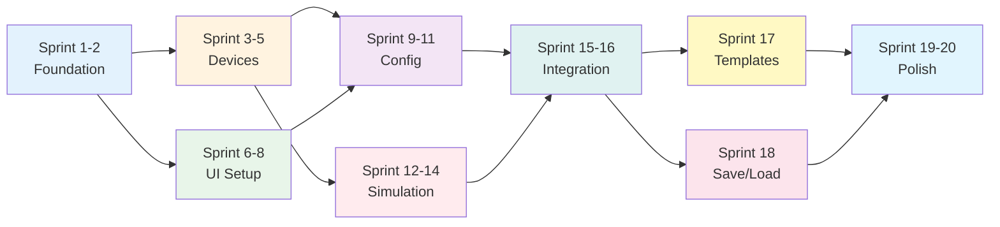

# Network Simulator - Project Status

## 📋 Documentation Status

### ✅ Complete Documentation

1. **ARCHITECTURE_DESIGN.md** (2,777 lines)
   - ✅ Complete class hierarchy
   - ✅ All device classes specified
   - ✅ Packet flow architecture
   - ✅ System design considerations (20 sections)
   - ✅ UX/UI design philosophy (22 sections)
   - ✅ Visual Mermaid diagrams (12 diagrams)
   - ✅ Design patterns documented

2. **IMPLEMENTATION_PLAN.md** (1,030 lines)
   - ✅ 9 Phases defined
   - ✅ 20 Sprints broken down
   - ✅ Detailed tasks per sprint
   - ✅ Dependencies mapped
   - ✅ Success criteria
   - ✅ Risk management

3. **READINESS_CHECKLIST.md**
   - ✅ Verification that all docs are complete
   - ✅ Ready to start checklist

---

## ✅ Ready for Implementation

### What's Complete

- ✅ **Architecture Design** - Fully specified with diagrams
- ✅ **UX/UI Design** - Complete user experience plan
- ✅ **Implementation Plan** - Sprint-by-sprint breakdown
- ✅ **Project Setup** - Next.js app created
- ✅ **Assets** - All device images available

### What's Needed to Start

**Nothing!** All documentation is complete. We can start implementing immediately.

---

## 🚀 Implementation Phases Summary

### Phase 1: Foundation (Sprints 1-2) - 8-12 days
- Type definitions
- Utility functions
- Base device classes

### Phase 2: Core Devices (Sprints 3-5) - 17-24 days
- Endpoint devices (PC, Laptop, Phone, Server)
- Network devices (Switch, Router, Firewall, Cloud)

### Phase 3: UI Foundation (Sprints 6-8) - 13-19 days
- Canvas setup
- Device palette
- Basic interactions

### Phase 4: Configuration (Sprints 9-11) - 17-24 days
- Form-based configuration
- Validation
- Auto-configuration

### Phase 5: Simulation (Sprints 12-14) - 19-27 days
- Packet system
- Simulation engine
- ARP & routing

### Phase 6: UI Integration (Sprints 15-16) - 10-14 days
- Simulation controls
- Packet visualization
- Testing tools

### Phase 7: Templates (Sprint 17) - 5-7 days
- Template library
- Onboarding wizard

### Phase 8: Save/Load (Sprint 18) - 5-7 days
- Persistence
- Export/Import

### Phase 9: Polish (Sprints 19-20) - 10-14 days
- Performance optimization
- Final polish
- Documentation

**Total Estimated Time**: 104-148 days (approximately 15-21 weeks)

---

## 📊 Implementation Roadmap

---

## 🎯 First Sprint: Ready to Start

### Sprint 1: Type Definitions & Utilities

**What We'll Build**:
1. Type definitions folder structure
2. All TypeScript interfaces and enums
3. Utility functions (UUID, MAC, IP)
4. Testing setup

**Duration**: 3-5 days

**Dependencies**: None

**Ready to Start**: ✅ **YES**

---

## 📝 Implementation Checklist

### Pre-Implementation
- [x] Architecture design approved
- [x] Implementation plan created
- [x] Documentation complete
- [x] Project structure ready

### Ready to Begin
- [x] All documentation in place
- [x] Sprint plan defined
- [x] Tasks identified
- [x] Success criteria clear

---

## 🎬 Next Steps

1. **Review Documentation**
   - Read ARCHITECTURE_DESIGN.md
   - Review IMPLEMENTATION_PLAN.md
   - Verify readiness checklist

2. **Approve & Start**
   - Approve architecture
   - Approve implementation plan
   - Begin Sprint 1

3. **Sprint 1 Tasks**
   - Create types folder
   - Define all TypeScript types
   - Create utility functions
   - Set up testing

---

## ✅ Conclusion

**Everything is ready!** The documentation is comprehensive and complete. We can start implementing Sprint 1 immediately once you give approval.

All architecture, design, and planning documentation is in place for a systematic, phase-by-phase implementation.
